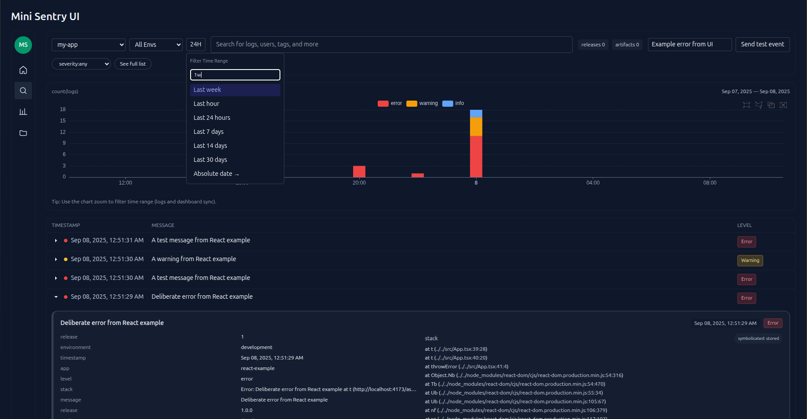
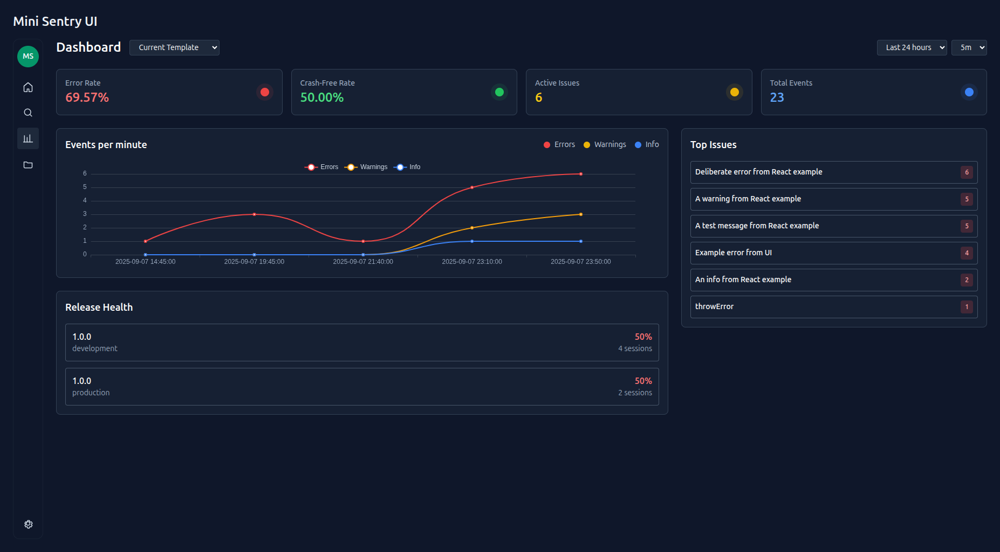
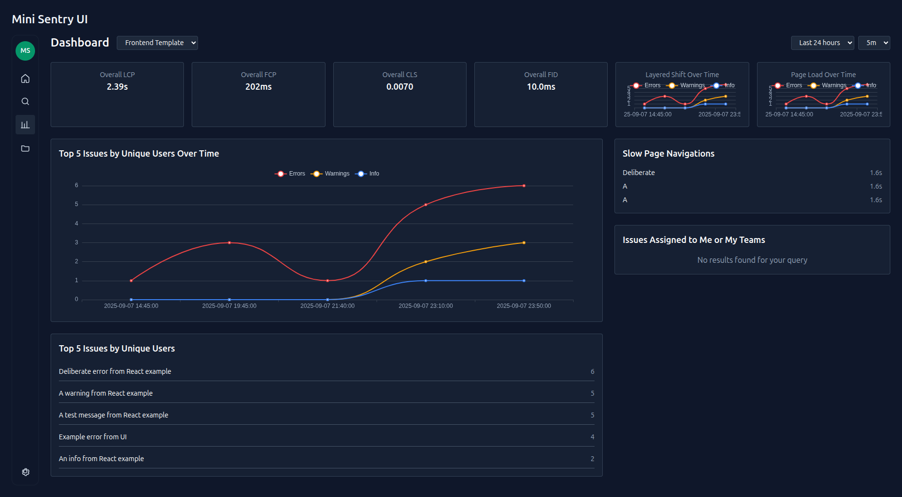
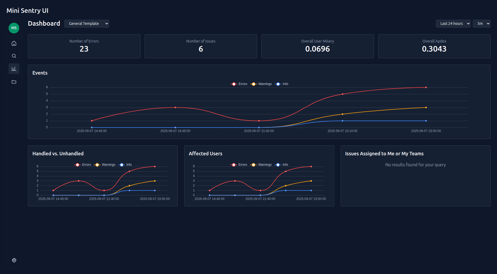
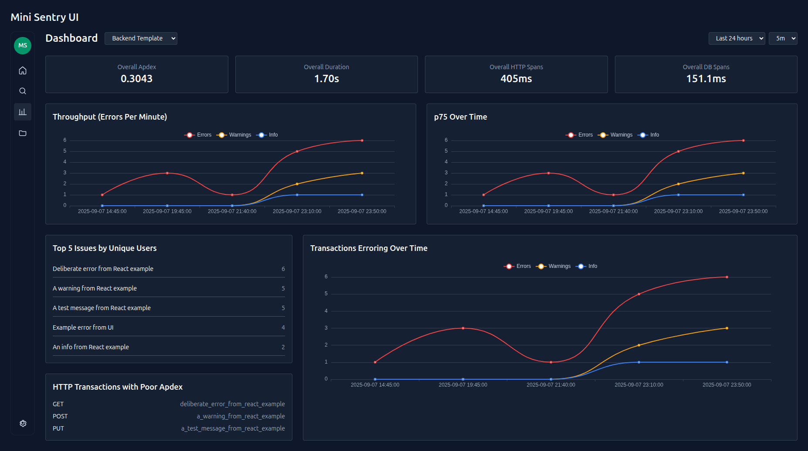
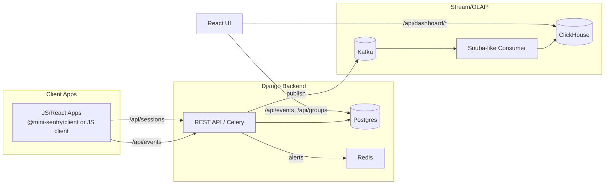

# Mini Sentry-like Stack (Dockerized)



## Dashboard Templates

Mini Sentry includes multiple dashboard layouts inspired by Sentry's different monitoring focuses:

### Current Template

*Comprehensive overview with key metrics cards, interactive ECharts, release health tracking, recent deployments, and top issues.*

### Frontend Template  

*Performance-focused dashboard featuring Core Web Vitals (LCP, FCP, CLS, FID), page load metrics, and frontend-specific issue tracking.*

### General Template

*Error tracking focused layout with error counts, issue metrics, user experience scores (Apdex), and handled vs unhandled error breakdowns.*

### Backend Template

*API performance monitoring with response times, database query performance, HTTP transaction analysis, and backend error patterns.*

Sentry-inspired, end-to-end stack you can run locally in Docker:

- Backend: Django (REST API) + Celery (worker/beat)
- Storage: PostgreSQL (relational), Redis (cache/broker)
- Stream/OLAP: Kafka + ClickHouse with a tiny Snuba-like consumer
- UI: Vite + React dev server
- Orchestration: Docker Compose

## Quickstart

1. Copy `.env.example` to `.env` if you want to override defaults.
2. Build and run all services:

```bash
docker compose up --build
```

3. Create a project (UI or API):

```bash
# UI: http://localhost:8000/

# API:
curl -X POST http://localhost:8000/api/projects/ \
  -H 'Content-Type: application/json' \
  -d '{"name":"My App","slug":"my-app"}'
```

4. Ingest an event for that project (token is shown in the UI or `/api/projects/`):

```bash
curl -X POST http://localhost:8000/api/events/ingest/token/<TOKEN>/ \
  -H 'Content-Type: application/json' \
  -d '{"message":"Example error","level":"error","release":"1.0.0","environment":"production"}'
```

5. List events:

```bash
curl http://localhost:8000/api/events/
# React UI
open http://localhost:5173/
```

Admin is available at `/admin` (create a superuser inside the `web` container if needed):

```bash
docker compose exec web python manage.py createsuperuser
```

## Stack Notes (How Sentry does it)

Sentry’s production stack includes:

- Python+Django app with Celery workers
- PostgreSQL (relational store)
- Redis (cache and Celery broker)
- Kafka (stream), ClickHouse (column store), Snuba service for querying events
- Relay (ingest, Rust) and Symbolicator (processing, Rust)
- Frontend: React/TypeScript

This repo mirrors a smaller but integrated set (Django, Celery, Redis, Postgres, Kafka, ClickHouse, basic Snuba-like consumer, React UI).

## Stack Overview (This Project)

- Backend: Django REST API (+ Celery worker/beat) for ingest, groups, releases/artifacts, sessions, alerts, and dashboard.
- Storage: PostgreSQL (primary relational store), Redis (cache + Celery broker/result backend).
- Stream/OLAP: Kafka (events/sessions topics) + Snuba-like consumer → ClickHouse (OLAP for series/top groups/health).
- Frontend: React + Vite dev server (Tailwind, dark mode), with Logs view (token search + brush), Groups/actions, Releases/Artifacts, Deployments, Release Health, and a Dashboard.
- Client SDKs: TypeScript package `@mini-sentry/client` and plain JS examples (`examples/js-client`: ESM + IIFE) for apps without TS/bundlers.
- Symbolication: Upload JS sourcemaps as release artifacts; ingest performs best-effort symbolication; UI falls back to `POST /api/symbolicate/` when needed.
- Alerts: Email/Webhook targets, snooze/unsnooze, rate limiting and windowed thresholds.
- Orchestration: Docker Compose services — `web`, `worker`, `beat`, `postgres`, `redis`, `kafka`, `clickhouse`, `snuba`, `frontend`.
  - Ports: API 8000, UI 5173, Example UI 5174, Postgres 5432, Redis 6379, Kafka 9092, ClickHouse 8123.
- CORS/Proxy: CORS enabled for dev via `django-cors-headers`; in app UIs use a dev proxy for `/api` or set `baseUrl` to the backend origin.
- URL State: Logs view persists `view/project/q/level/env/release/from/to` in the URL hash; Dashboard respects `from/to` so charts match the Logs brush selection.

High‑level data flow
1) App/UI → `POST /api/events/ingest/token/{token}` (and optional `sessions` ingest)
2) Django stores event in Postgres, evaluates alerts, publishes to Kafka
3) Snuba-like consumer reads Kafka and writes rollups to ClickHouse
4) UI reads recent events/groups from Postgres; dashboard series/top groups from ClickHouse
5) Sourcemaps uploaded to a matching Release enable symbolicated stacks in event detail

## Examples

This repo includes runnable examples for several stacks under `examples/`:

- React (Vite): full test lab with sourcemap uploader (`examples/react`)
- Plain JS client: ESM + IIFE drop‑in clients (`examples/js-client`)
- Node.js (Express): minimal server + error-handling middleware (`examples/node-express`)
- Python (Flask): app with a global error handler (`examples/python-flask`)
- Python (FastAPI): app with a global exception handler (`examples/python-fastapi`)
- Go (net/http): minimal POST example (`examples/go-nethttp`)
- Ruby: Rails middleware (`examples/ruby-rails`), Sinatra app (`examples/ruby-sinatra`)
- Next.js: API route + client init (`examples/node-nextjs`)
- Vue and Angular: client init guides (`examples/vue-vite`, `examples/angular`)
- AWS Lambda (Node.js): handler + Serverless snippet (`examples/serverless-aws`)

Compose services:
- `fastapi-example` and `flask-example` can be brought up with Docker Compose; set `MS_TOKEN` in `docker-compose.yml`.

See `examples/README.md` for commands and details.



## Development

- Web service: `http://localhost:8000`
- Celery worker/beat run in their own containers.
- Code changes auto-reload if you restart the container or mount volumes (already configured).

## Extras: Kafka + ClickHouse + Snuba-like

- Added `kafka` and `clickhouse` services in Compose.
- Django publishes events to Kafka topic `events` (events) and `sessions` (release health).
- `snuba` service (Python) consumes both and inserts into ClickHouse `sentry.events` and `sentry.sessions` tables.
- Query ClickHouse events via API: `GET /api/events/clickhouse?project=<slug>&limit=100`.

## Frontend (React)

- Dev server: `http://localhost:5173`
- Proxies `/api` to backend (`web:8000`) inside Compose.
- Lists projects, groups, recent events; sends test events.
- Create releases, upload artifacts (source maps), and view symbolicated stacks.
- Create deployments and ingest sessions; view health summary and time series.
- Create/edit alert rules, add alert targets, and snooze rules per group.
- Server‑side search for Events and Groups (search box + filters).
- Dashboard (time series + Top Groups), aligned with the Logs selection.

### Logs View (ECharts)

- Stacked bars by level (error/warning/info).
- Drag on the chart to select a time range — the chart zooms and Logs + Dashboard filter to the selection.
- Click a single bar to focus that bucket.
- Wheel/pinch zoom inside (no visible slider); reset zoom via “See full list”.
- Legend toggles hide levels in the table; selecting exactly one level applies the server filter.
- Human‑readable timestamps and colored level badges in the table.
- Time Range menu (Sentry‑style): quick options (Last hour/24 hours/7–30 days) + custom ranges (e.g., `2h`, `4d`, `3w`).
- “See full list” resets time range to 24h, clears level filter, and resets zoom.

## API Docs

- Swagger UI (served by app): `http://localhost:8000/docs/`
- OpenAPI spec (YAML): `docs/openapi.yaml`
- Postman collection: `postman/mini-sentry.postman_collection.json`

Validate the spec locally:

```bash
make openapi-validate
# or using Docker + Redocly
make openapi-validate-docker
```

## User Guide (Instrument Your App)

You can report errors and sessions either with a tiny local client file or via the packaged client.

Option A — Quick local client (copy file)
- Copy `examples/react/src/miniSentry.ts` into your app and initialize once on startup:

```ts
import { initMiniSentry, MiniSentryErrorBoundary } from './miniSentry'
const ms = initMiniSentry({ token: '<TOKEN>', baseUrl: 'http://localhost:8000', release: '1.0.0', environment: 'development' })
```

Option B — Package: `@mini-sentry/client` (recommended)
- Build the package locally and install it in your apps:

```bash
cd packages/mini-sentry-client && npm install && npm run build
# In your app:
npm i ../../packages/mini-sentry-client
```

- Initialize and (optionally) wrap your root with the provided ErrorBoundary:

```ts
import { initMiniSentry, MiniSentryErrorBoundary } from '@mini-sentry/client'
const ms = initMiniSentry({ token: import.meta.env.VITE_MS_TOKEN, baseUrl: '', release: '1.0.0', environment: import.meta.env.MODE })
```

Sending events and sessions

```ts
ms.captureException(new Error('boom'), { where: 'DemoButton' })
ms.captureMessage('hello from app', { foo: 'bar' })
ms.sendSession('ok')          // or 'crashed'
```

Readable stacks (sourcemaps)
- Build your app with sourcemaps enabled (e.g., Vite `build.sourcemap = true`)
- Create a release in Mini Sentry that matches your app’s release + environment
- Upload generated `*.js.map` files to that release (see `examples/react/upload_sourcemap.mjs`)
- Trigger an error; click “View” on the event to see orig_file/orig_line/orig_column

Dev/prod tips
- Local dev: run your UI dev server with a proxy so `/api` → `http://localhost:8000`
- Prod: host UI + API on same domain, or enable CORS on the backend
- Rate limit defaults to 120 events/min/project (configurable via env)

## Monitoring Errors (Where to look)

- Mini Sentry UI: http://localhost:5173
  - Select a project → see “Groups” (deduplicated issues) and “Recent Events”.
  - Click “View” on an event to see stored (symbolicated) frames.
- Django Admin: http://localhost:8000/admin
  - Create a superuser: `docker compose exec web python manage.py createsuperuser`
  - Browse Events, Groups, Releases, Artifacts, Alert Rules, Deployments.
- APIs (for automation/dashboards)
  - Events (PG): `GET /api/events/?project=<slug>`
    - Supports absolute time range: `from=<ISO8601>&to=<ISO8601>`
      - Example: `/api/events/?project=my-app&from=2025-09-07T00:00:00Z&to=2025-09-07T01:00:00Z`
    - Supports server‑side search via `q` parameter with tokens:
      - Events tokens: `level:<error|warning|info>`, `env:<name>`, `release:<version>`, `message:<substring>`, plus bare words (matched on message).
      - Example: `GET /api/events/?project=my-app&q=level:error env:production timeout`.
  - Groups: `GET /api/groups/?project=<slug>`
    - Supports search via `q` with tokens: `status:<open|resolved|ignored>`, `assignee:<user>`, `title:"quoted phrase"`, plus bare words (matched on title).
      - Example: `GET /api/groups/?project=my-app&q=status:open title:"database error"`.
  - Event detail: `GET /api/events/{id}/` (includes symbolicated frames)
  - Events (ClickHouse): `GET /api/events/clickhouse?project=<slug>&limit=100`
  - Health summary: `GET /api/releases/health/?project=<slug>`
  - Health time series: `GET /api/releases/health/series/?project=<slug>&range=24h&interval=5m[&backend=ch]`
  - Dashboard:
    - Series (EPM by level): `GET /api/dashboard/series/?project=<slug>&range=1h|24h&interval=5m|1h[&backend=ch]`
    - Top Groups: `GET /api/dashboard/top-groups/?project=<slug>&range=24h&limit=10[&backend=ch]`

### Dashboard

A minimal Dashboard is included in the UI (above Releases, and as a tab in the refactored layout):

- Errors per minute (EPM) by level (basic SVG line chart)
- Top Groups over a selectable time range
- Range and interval pickers

Planned enhancements: per‑level breakdowns, spike detector, release comparisons, and auto‑refresh.

## Frontend Telemetry (Optional)

By default, the main UI in `frontend/` is NOT instrumented so this repo stays portable and neutral. To test the client package end‑to‑end, use the example app in `examples/react`, which is already wired to `@mini-sentry/client` and includes a sourcemap uploader.

If you want to instrument your own app (or this UI) with the package:

1) Build the client package locally: `cd packages/mini-sentry-client && npm i && npm run build`
2) In your app, install it (local path): `npm i ../../packages/mini-sentry-client`
3) Initialize once on startup and wrap your root with `MiniSentryErrorBoundary` (see the User Guide above).
4) For symbolication, build with sourcemaps and upload the generated `*.map` files to a matching release + environment.

Note: The UI dev server proxies `/api` to the backend container `web:8000`.

## Deployments and Release Health

- Create deployment records: `POST /api/deployments/` with `{ "project": <id>, "release": <id>, "environment": "production", "name": "Deploy #1", "url": "https://example.com" }`
- Ingest sessions (token-based): `POST /api/sessions/ingest/token/{token}/` with `{ "session_id": "abc123", "status": "ok|errored|crashed|exited", "release": "1.0.0", "environment": "production", "user": "u123", "duration_ms": 1200 }`
- Health summary: `GET /api/releases/health/?project=<slug>` → `[ { version, environment, total_sessions, crashed_sessions, crash_free_rate } ]`
- Health time series (Postgres): `GET /api/releases/health/series/?project=<slug>&range=24h&interval=5m`
- Health time series (ClickHouse): add `&backend=ch` to use ClickHouse rollups.

The React UI includes simple buttons to submit ok/crashed sessions and display crash-free rates.

## Frontend Search & Actions (Examples)

- Try these in the project page’s Search box:
  - Events examples: `level:error`, `env:production`, `release:1.2.3`, `message:db`, `timeout` (bare term)
  - Groups examples: `status:open`, `assignee:alice`, `title:"api failed"`, `payment`
- Group actions available from the Groups table:
  - Resolve / Unresolve / Ignore / Assign / Comment (and Snooze if an alert rule exists)

## Source Maps (JS)

- Upload a standard Source Map v3 JSON as a release artifact (e.g., `app.js.map`). The app includes a minimal VLQ decoder and sourcemap parser to map generated `(line,column)` to original source and name. It also supports a simple `function_map` JSON. Artifact metadata records `file_name` (from sourcemap `file`) and `checksum`.
- Symbolication API: `POST /api/symbolicate/` with either:
  - `frames: [{ "file": "app.js", "line": 10, "column": 120, "function": "t" }]`
  - or `stack: "error stack trace string..."` (Chrome/Firefox formats)
  - Include `project`, `release`, and `environment`.

Notes: This implementation is intentionally minimal and won’t handle all edge cases of complex bundlers, but it’s enough for basic mappings.


## DSN-like Token and Ingestion

Each project now has an `ingest_token`. You can ingest by slug or token:

- By slug: `POST /api/events/ingest/{project_slug}/`
- By token: `POST /api/events/ingest/token/{token}/`

Payload example:

```json
{
  "message": "Example error",
  "level": "error",
  "extra": {"foo": "bar"}
}
```

Create a project and get its token from the UI at `/` or via management command:

```bash
docker compose exec web python manage.py create_project "My App"
```

### Client example (Python)

```python
import requests

TOKEN = "<project_ingest_token>"
url = f"http://localhost:8000/api/events/ingest/token/{TOKEN}/"
payload = {"message": "Example from Python", "level": "error", "extra": {"foo": "bar"}}
resp = requests.post(url, json=payload, timeout=5)
resp.raise_for_status()
print(resp.json())
```

## API Summary

- Projects: `GET/POST /api/projects/`
- Events:
  - `GET /api/events/?project=<slug>`; `GET /api/events/{id}/`
  - Ingest by slug/token: `POST /api/events/ingest/<slug|token/...>/`
  - ClickHouse: `GET /api/events/clickhouse?project=<slug>&limit=100`
- Groups: `GET /api/groups/?project=<slug>`
- Releases: `GET/POST /api/releases/`; artifacts: `GET/POST /api/releases/{id}/artifacts/`
- Symbolicate: `POST /api/symbolicate/`
- Sessions: `POST /api/sessions/ingest/token/{token}/`
- Health: `GET /api/releases/health/?project=<slug>`; `GET /api/releases/health/series/?project=<slug>&range=24h&interval=5m[&backend=ch]`
- Deployments: `GET/POST /api/deployments/`
- Alerts: `GET/POST/PATCH/DELETE /api/alert-rules/`; `POST /api/alert-rules/{id}/snooze|unsnooze/`; `GET/POST /api/alert-rules/{id}/targets/`; `GET /api/alert-rules/by-group/{group_id}`
- Healthcheck: `GET /api/health/`

## Environment

Key env vars (see `.env.example`):
- General: `DJANGO_DEBUG`, `SECRET_KEY`, `ALLOWED_HOSTS`
- Postgres: `DATABASE_URL`
- Redis/Celery: `REDIS_URL`, `CELERY_BROKER_URL`, `CELERY_RESULT_BACKEND`
- Kafka: `KAFKA_BOOTSTRAP_SERVERS`, `KAFKA_TOPIC` (events), `KAFKA_SESSIONS_TOPIC` (sessions), `KAFKA_TOPICS`
- ClickHouse: `CLICKHOUSE_URL`, `CLICKHOUSE_DATABASE`
- Ingest limits/retention: `RATE_LIMIT_EVENTS_PER_MINUTE`, `RETENTION_DAYS`
- Email: `EMAIL_BACKEND`, `EMAIL_HOST`, `EMAIL_PORT`, `EMAIL_*`

## Alerts (Email/Webhook)

- Create alert rule: `POST /api/alert-rules/` with `{ "project": <id>, "name": "High error volume", "level": "error", "threshold_count": 10, "threshold_window_minutes": 5, "notify_interval_minutes": 60, "target_type": "email", "target_value": "alerts@example.test" }`
- Rules trigger when a group’s recent event volume within `threshold_window_minutes` reaches `threshold_count`. Notifications are rate-limited by `notify_interval_minutes` per group.
  - Email: Django email backend (console by default). Configure SMTP via env.
  - Webhook: POSTs JSON payload to `target_value` URL.

Snooze per group/rule:

- `POST /api/alert-rules/{id}/snooze/` with `{ "group": <group_id>, "minutes": 60 }`
- `POST /api/alert-rules/{id}/unsnooze/` with `{ "group": <group_id> }`

Multiple targets per rule:

- `GET /api/alert-rules/{id}/targets/`
- `POST /api/alert-rules/{id}/targets/` with `{ "target_type": "email|webhook", "target_value": "...", "subject_template": "optional", "body_template": "optional" }`

Edit rules:

- `PATCH /api/alert-rules/{id}/` to update thresholds and intervals.

List rules for a group:

- `GET /api/alert-rules/by-group/{group_id}`

Env variables for email (optional): see `.env.example` (`EMAIL_*`).
